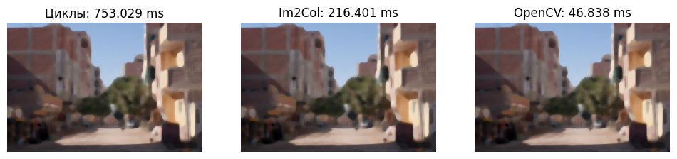
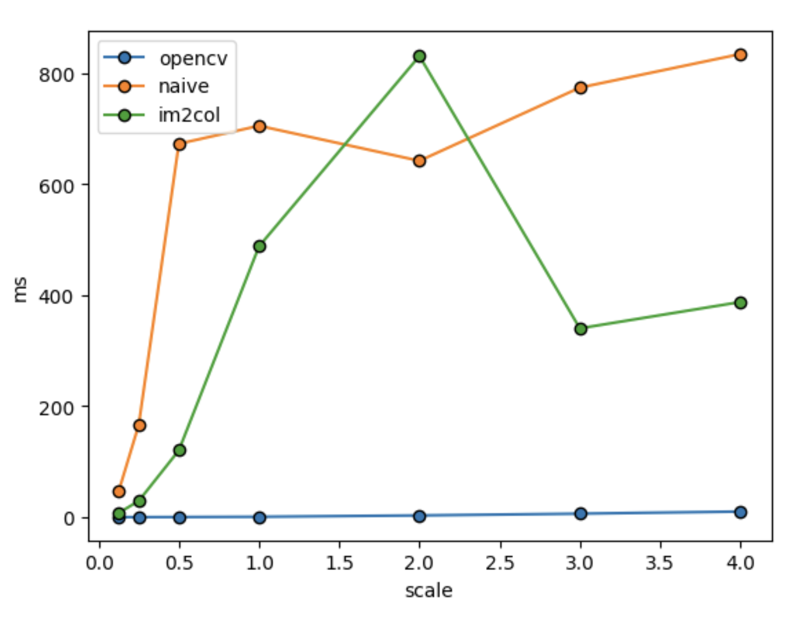
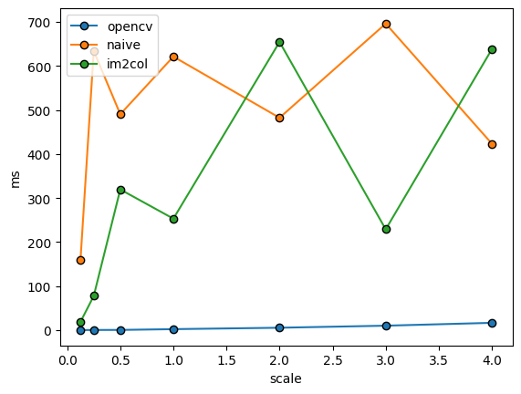

# Лабораторная работа №1

Вариант 4.

## Теоретическое обоснование
Медианный фильтр - фильтр, используемый для уменьшения уровня шума. Задается радиус окна фильтрации (`kernel_size`), это нечетное число. Для пикселя берутся значения сигнала (пикселей) внутри окна вокруг него, ищется их медианное значение. Оно является выходом фильтра для данного пикселя.

Для сохранения размерности выполняется паддинг - добавление пикселей с каждой стороны изображения. Число добавленных пикселей равно `(kernel_size - 1)//2`. В `opencv` используется паддинг значением края, то есть дополненные пиксели такие же, как имеющийся граничный.

## Реализация
### "Наивный" алгоритм
Для загруженного изображения выполняется паддинг. После в двух циклах производится обход всех пикселей - в окне вокруг каждого пикселя ищется медианное значение и записывается на то же положение в массиве-результате. Из-за двух циклов обход изображения может занять много времени. Для ускорения можно использовать подход `Im2Col`, применяемый в операции свертки - так медиана будет искаться один раз (более оптимально за счет внутренних оптимизаций numpy).

### `Im2Col`
Для реализации алгоритма через `im2col` изображение должно быть преобразовано в массив размерности `[kernel_size*kernel_size, C*H*W]`. Все каналы обрабатываются отдельно. Для этого также используется вложенный цикл. Затем ищется медианное значение по первой оси массива, а затем выполняется его преобразование в нужный размер. Таким образом удается сэкономить немного времени на вычислении медианы.

## Результаты
Для сравнения с эталонной обработкой были выполнены `np.testing.assert_almost_equal()` - все проверки были пройдены. Результирующие картинки полностью совпадают.

Для сравнения по времени исходное изображение (размера (500, 333, 3)) было изменено по размерности в `scale` раз. `scale` вариьируется по следующему списку: `scale = (1/8, 1/4, 1/2, 1, 2, 3, 4)`. Для каждого увеличенного/уменьшенного изображения засекается время работы алгоритма. Результат представлен на графике ниже. Использовалось ядро размером 5.

Очевидно, реализация на `opencv` наиболее стабильна по времени, оно растет экспоненциально с ростом размера картинки. При этом реализации в виде циклов или `im2col` по времени отстают, но лучшего из них выделить нельзя. В некоторых случаях наивная реализация работает быстрее. Это связано с загрузкой процессора в конкретный момент времени.

## Выводы

В процессе выполнения лабораторной работы были протестированы различные реализации алгоритма медианной фильтрации. Результаты совпадают, но эталонная реализация значительно выигрывает по времени.