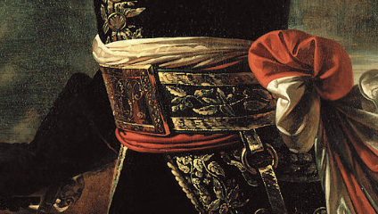

# Простейшие алгоритмы сопоставления изображений

<div align="left">
    
    <div style="display: flex; justify-content: left; gap: 20px; margin-top: 20px;">
        
        
    </div>
</div>

## Теоретическая база

### 1. Template Matching (Сопоставление шаблонов)

Template matching - это метод обработки изображений для поиска частей изображения, которые соответствуют шаблонному изображению (template). Основные принципы:

- Метод использует скользящее окно размером с шаблон для поиска соответствий на исходном изображении
- На каждом шаге вычисляется мера схожести между шаблоном и текущей областью
- Основные методы сравнения:
  - Метод квадратов разностей (Square Difference)
  - Метод корреляции (Correlation)
  - Коэффициент корреляции (Correlation Coefficient)

#### Преимущества:
- Простота реализации
- Работает хорошо при точном совпадении шаблона

#### Недостатки:
- Чувствителен к изменениям масштаба и поворота
- Не устойчив к изменениям освещения
- Высокая вычислительная сложность для больших изображений

#### Реализация на Python

```python

class TemplateImageSearcher(ImageSearcher):
    def __init__(self, step: int = 1, threshold: float = 0.01):
        """
        Initialize the TemplateImageSearcher.

        Args:
            step: Step size for sliding window iteration (default=1).
                 Higher values will search fewer positions but be faster.
        """
        self.step = max(1, step)
        self.threshold = threshold

    def find_image(
        self,
        haystack: np.ndarray,
        needle: np.ndarray
    ) -> tuple[int, int, int, int] | None:
        """
        Find the needle image within the haystack image.

        Args:
            haystack: The larger image to search in (numpy array)
            needle: The smaller image to find (numpy array)

        Returns:
            Tuple of (x, y, width, height) representing the matching rectangle,
            or None if no match is found
        """
        # Obtain the dimensions of the needle and haystack images
        needle_height, needle_width = needle.shape[:2]
        haystack_height, haystack_width = haystack.shape[:2]

        # Check if the needle is larger than the haystack
        if needle_height > haystack_height or needle_width > haystack_width:
            return None

        # Create a result matrix
        result = np.full((haystack_height - needle_height + 1,
                           haystack_width - needle_width + 1), np.inf)

        # Iterate over the haystack with a sliding window
        for y in range(0, result.shape[0], self.step):
            for x in range(0, result.shape[1], self.step):
                # Extract the current window
                window = haystack[y:y+needle_height, x:x+needle_width]
                # Calculate the sum of squared differences
                diff = np.sum((window - needle) ** 2) / (needle_height * needle_width)
                result[y, x] = diff

        if np.min(result) > self.threshold:
            return None

        # Get the position of the best match
        y, x = np.unravel_index(np.argmin(result), result.shape)

        return (x, y + needle_height, needle_width, needle_height)
```

### 2. SIFT (Scale-Invariant Feature Transform)

SIFT - это алгоритм компьютерного зрения для обнаружения и описания локальных признаков изображения. Основные этапы:

1. Определение экстремумов в пространстве масштабов
2. Уточнение положения ключевых точек
3. Назначение ориентации
4. Построение дескрипторов ключевых точек

#### Ключевые точки (Keypoints)
Ключевая точка - это особая точка на изображении, которая обладает отличительными характеристиками. Каждая ключевая точка содержит:
- Координаты (x,y) на изображении
- Масштаб (размер области вокруг точки)
- Ориентацию (доминирующее направление градиента)

Типичными ключевыми точками являются:
- Углы
- Края
- Области с высокой контрастностью
- Точки со значительным изменением интенсивности в разных направлениях

#### Дескрипторы (Descriptors)
Дескриптор - это числовой "отпечаток", описывающий область вокруг ключевой точки:
- Представляет собой 128-мерный вектор
- Описывает распределение градиентов вокруг ключевой точки
- Разработан для обеспечения:
  - Инвариантности к повороту
  - Устойчивости к изменениям освещения
  - Уникальности для точного сопоставления

#### Сопоставление признаков (Feature Matching)

После получения ключевых точек и их дескрипторов необходимо найти соответствия между ними на разных изображениях. Для этого используется FLANN (Fast Library for Approximate Nearest Neighbors):

- FLANN - это библиотека для быстрого поиска ближайших соседей в многомерных пространствах
- Использует KD-деревья для эффективного поиска
- Параметры:
  - `algorithm=FLANN_INDEX_KDTREE` - использование KD-дерева для индексации
  - `trees=5` - количество параллельных деревьев поиска
  - `checks=50` - количество проверок при поиске (больше проверок = выше точность, ниже скорость)

#### Фильтрация совпадений
Для повышения качества сопоставления применяется тест отношения расстояний Лоу (Lowe's ratio test):
- Для каждой точки находятся два ближайших соседа
- Если отношение расстояний до первого и второго соседа меньше порога (обычно 0.7-0.8), совпадение считается надежным
- Помогает отфильтровать ложные совпадения

### Гомография (Homography)

Гомография - это проективное преобразование, которое описывает соответствие между двумя плоскостями:

- Представляется матрицей 3x3
- Позволяет учесть:
  - Перенос (translation)
  - Поворот (rotation)
  - Масштабирование (scaling)
  - Перспективные искажения (perspective distortion)

#### Метод RANSAC
Для надежного нахождения матрицы гомографии используется алгоритм RANSAC (Random Sample Consensus):

1. Случайно выбирается минимальный набор точек (4 пары для гомографии)
2. Вычисляется матрица преобразования
3. Проверяется, сколько других точек соответствуют этому преобразованию
4. Процесс повторяется несколько раз
5. Выбирается лучшее преобразование

Преимущества RANSAC:
- Устойчивость к выбросам (outliers)
- Способность находить правильное решение даже при наличии значительного шума
- Не требует предварительной фильтрации данных

#### Реализация на Python

```python
class SiftImageSearcher(ImageSearcher):
    def find_image(
        self,
        haystack: np.ndarray,
        needle: np.ndarray
    ) -> tuple[int, int, int, int] | None:
        """
        Find the needle image within the haystack image using SIFT features.
        Args:
            haystack: The larger image to search in (numpy array)
            needle: The smaller image to find (numpy array)

        Returns:
            Tuple of (x, y, width, height) representing the matching rectangle,
            or None if no match is found
        """
        # Initialize SIFT detector
        sift = cv2.SIFT.create()

        # Find keypoints and descriptors for both images
        kp1, des1 = sift.detectAndCompute(needle, None)
        kp2, des2 = sift.detectAndCompute(haystack, None)

        # If no features found, return None
        if des1 is None or des2 is None or len(kp1) < 2 or len(kp2) < 2:
            return None

        # Create FLANN matcher
        FLANN_INDEX_KDTREE = 1
        index_params = dict(algorithm=FLANN_INDEX_KDTREE, trees=5)
        search_params = dict(checks=50)
        flann = cv2.FlannBasedMatcher(index_params, search_params)

        # Find matches
        matches = flann.knnMatch(des1, des2, k=2)

        # Apply ratio test to find good matches
        filtered_matches = []
        for nearest_match, second_nearest_match in matches:
            if nearest_match.distance < 0.7 * second_nearest_match.distance:
                filtered_matches.append(nearest_match)

        # Need at least 4 good matches to find homography
        if len(filtered_matches) < 4:
            return None

        # Get coordinates of matching points
        src_pts = np.float32([kp1[m.queryIdx].pt for m in filtered_matches]).reshape(-1, 1, 2)
        dst_pts = np.float32([kp2[m.trainIdx].pt for m in filtered_matches]).reshape(-1, 1, 2)

        # Find homography matrix
        H, _ = cv2.findHomography(src_pts, dst_pts, cv2.RANSAC, 5.0)
        if H is None:
            return None

        # Get corners of needle image
        h, w = needle.shape[:2]
        corners = np.float32([[0, 0], [0, h-1], [w-1, h-1], [w-1, 0]]).reshape(-1, 1, 2)

        # Transform corners to find location in haystack
        transformed = cv2.perspectiveTransform(corners, H)

        # Get bounding rectangle
        x = int(min(transformed[:, 0, 0]))
        y = int(min(transformed[:, 0, 1]))
        w = int(max(transformed[:, 0, 0]) - x)
        h = int(max(transformed[:, 0, 1]) - y)

        return (x, y, w, h)
```

#### Преимущества:
- Инвариантность к масштабу и повороту
- Устойчивость к изменениям освещения
- Устойчивость к шуму
- Высокая различимость признаков

#### Недостатки:
- Более сложная реализация
- Высокая вычислительная сложность
- Патентные ограничения (существуют альтернативы: SURF, ORB)

## Сравнение методов

| Характеристика | Template Matching | SIFT |
|----------------|-------------------|------|
| Устойчивость к повороту | Низкая | Высокая |
| Устойчивость к масштабу | Низкая | Высокая |
| Скорость работы | Зависит от размера изображения | Зависит от количества особых точек |
| Точность при точном совпадении | Высокая | Средняя |
| Сложность реализации | Низкая | Высокая |

### Практические результаты

В рамках выполнения работы были разработаны и реализованы два метода сопоставления изображений:
- Template Matching.
- SIFT.

Оба метода были протестированы на изображении Наполеона. SIFT показал лучшие результаты, так как он более устойчив к повороту и масштабированию. Template Matching показал хорошие результаты при точном совпадении, но был не очень устойчив к повороту.
