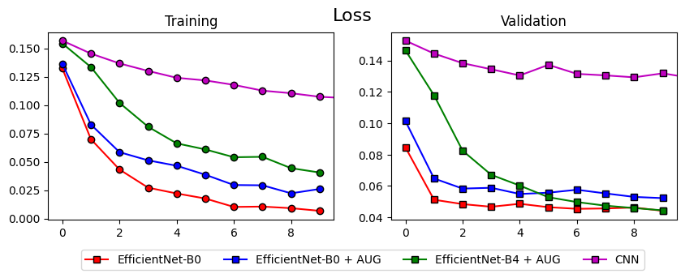
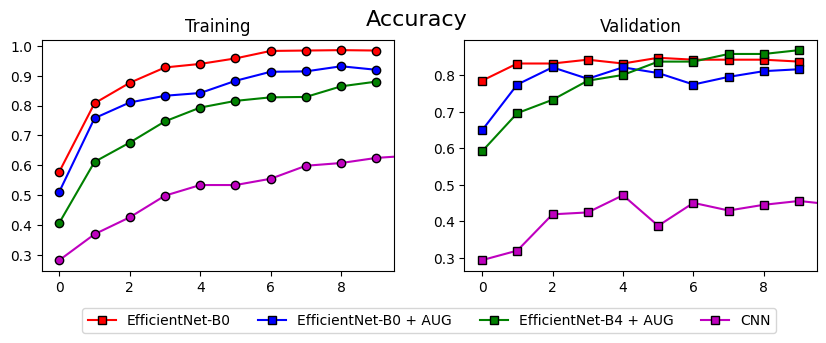
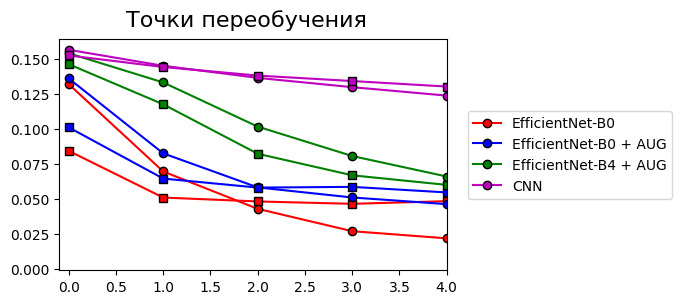
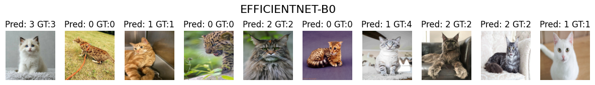
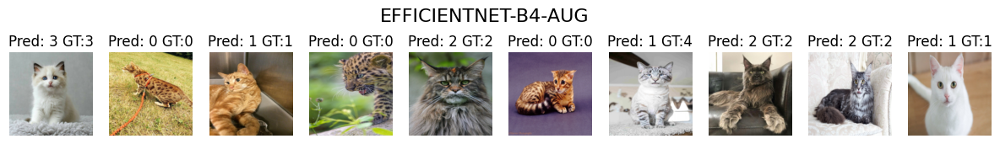

# Классификация изображений при помощи сверточных нейронных сетей
## Задача
* Выбранный датасет: [Cats Breed Dataset](https://www.kaggle.com/datasets/yapwh1208/cats-breed-dataset)
* Функция потерь: `nn.MSELoss`, метрика - `Accuracy`

## Разработка
### Подготовка датасета
Перед тем, как запустить обучение модели, нужно подготовить датасет. Для этого было выполнено следующее:
1. Очистка от нечитаемых `opencv` изображений (форматы `webp`, `htm`)
2. Перезапись изображений в меньшем размере с сохранением пропорции для ускорения загрузки

### Препроцессинг кадров
После загрузки кадров в память происходит их дополнительная обработка. В лабораторной работе рассматриваются два варианта обработки на лету: с аугментацией и без. Оба варианта включают в себя нормализацию и изменение размера до 200 на 200 пикселей.

#### Обработка без аугментации
```python
self.transform = transforms.Compose([
    transforms.ToTensor(),
    transforms.Lambda(lambda x: (x - torch.min(x)) / (torch.max(x) - torch.min(x))),
    transforms.Resize((200, 200), antialias=True)
])
```

#### Обработка с аугментацией
```python
self.augmentation_pipeline = A.Compose([
    A.Rotate(limit=(-45, 45)),
    A.RandomScale(scale_limit=(-0.5, 0.5)),
    A.OneOf([
        A.GaussianBlur(blur_limit=7, sigma_limit=0.2),
        A.ColorJitter(brightness=0.1, contrast=0.1, saturation=0.1),
        A.ToGray()
    ], p=1),
    A.Resize(height=200, width=200),
    A.Normalize(normalization="min_max", p=1.0),
    ToTensorV2()
])
self.transform = lambda x: self.augmentation_pipeline(image=x)["image"]
```

## Архитектура
Использовались следующие архитектуры: простая сверточная, EfficientNet-B0, EfficientNet-B4.
### Простая сверточная архитектура
```python
def build_simple_model():
    return nn.Sequential(
        nn.Conv2d(in_channels=3, out_channels=16, kernel_size=5, padding="same"), # (N, 16, 200, 200)
        nn.Conv2d(in_channels=16, out_channels=32, kernel_size=3, padding="same"), # (N, 32, 200, 200)
        nn.MaxPool2d(kernel_size=2), # (N, 32, 100, 100)

        nn.Conv2d(in_channels=32, out_channels=64, kernel_size=3, padding="same"), # (N, 64, 100, 100)
        nn.MaxPool2d(kernel_size=2), # (N, 64, 50, 50)

        nn.Conv2d(in_channels=64, out_channels=32, kernel_size=3, padding="same"), # (N, 32, 50, 50)
        nn.MaxPool2d(kernel_size=2), # (N, 32, 25, 25)
        nn.ReLU(),

        nn.Flatten(),
        nn.Linear(in_features=32*25*25, out_features=128),
        nn.Linear(in_features=128, out_features=5),
        nn.Softmax(dim=1)
 )
```
### EfficientNet
Оригинальная статья доступна по [ссылке](https://arxiv.org/pdf/1905.11946). Модели `B0` и `B4` отличаются количеством параметров.

```python
def build_efficientnet_b0(n_classes):
    base_model = efficientnet.efficientnet_b0(weights=efficientnet.EfficientNet_B0_Weights.IMAGENET1K_V1)
    base_model.classifier = nn.Sequential(
        nn.Linear(base_model.classifier[1].in_features, n_classes),
        nn.Softmax(dim=1)
    )
    return base_model


def build_efficientnet_b4(n_classes):
    base_model = efficientnet.efficientnet_b4(weights=efficientnet.EfficientNet_B4_Weights.IMAGENET1K_V1)
    base_model.classifier = nn.Sequential(
        nn.Linear(base_model.classifier[1].in_features, n_classes),
        nn.Softmax(dim=1)
    )
    return base_model
```

## Эксперименты
Всего было проведено 4 эксперимента.
1. Простая сверточная сеть без аугментации (2603589 парам.)
2. EfficientNet-B0 без аугментации (4013953 парам.)
3. EfficientNet-B0 с аугментацией (4013953 парам.)
4. EfficientNet-B4 с аугментацией (17557581 парам.)

### Сравнительные графики потерь и метрики:




Все модели завершили обучение вовремя - значение функции потерь и метрики на тестовой выборке практически не меняется. Установившееся значение функции потерь у простой сверточной сети выше, чем у моделей семейства EfficientNet - значит, можно ожидать худшее качество работы. Модели с добавлением аугментации имеют больший loss на обучающей выборке, чем модели без неё - это связано с искусственным увеличением выборки. При этом loss на тестовой выборке осталась на том же уровне.

Если построить значения функции потерь на тренировочной и тестовой выборке, то видно пересечение графиков. Это говорит о том, что модель переобучилась на тестовых данных. При этом чем больше модель по числу параметров, тем позже наступает переобучение. Если добавить аугментацию, то переобучение также наступит позже. В данной ситуации причина переобучения заключается в малом размере датасета: в тренировочной выборке в среднем по 160 кадров для каждого класса.



### Результаты

<details open>
<summary><b> Простая свёрточная модель </b></summary>


```
              precision    recall  f1-score   support

           0       0.50      0.65      0.56        31
           1       0.36      0.36      0.36        36
           2       0.47      0.21      0.29        39
           3       0.54      0.57      0.55        37
           4       0.47      0.58      0.52        48

    accuracy                           0.47       191
   macro avg       0.47      0.47      0.46       191
weighted avg       0.47      0.47      0.46       191
```
</details>

<details open>
<summary><b> EfficientNet-B0 без аугментации </b></summary>


```
              precision    recall  f1-score   support

           0       0.85      0.94      0.89        31
           1       0.88      0.81      0.84        36
           2       0.90      0.95      0.93        39
           3       0.81      0.78      0.79        37
           4       0.81      0.79      0.80        48

    accuracy                           0.85       191
   macro avg       0.85      0.85      0.85       191
weighted avg       0.85      0.85      0.85       191
```
</details>

<details open>
<summary><b> EfficientNet-B0 с аугментацией </b></summary>


```
              precision    recall  f1-score   support

           0       0.79      0.87      0.83        31
           1       0.76      0.69      0.72        36
           2       0.85      1.00      0.92        39
           3       0.84      0.84      0.84        37
           4       0.85      0.73      0.79        48

    accuracy                           0.82       191
   macro avg       0.82      0.83      0.82       191
weighted avg       0.82      0.82      0.82       191
```
</details>

<details open>
<summary><b> EfficientNet-B4 с аугментацией </b></summary>


```
              precision    recall  f1-score   support

           0       0.94      0.94      0.94        31
           1       0.82      0.92      0.87        36
           2       0.93      0.97      0.95        39
           3       0.79      0.89      0.84        37
           4       0.89      0.69      0.78        48

    accuracy                           0.87       191
   macro avg       0.87      0.88      0.87       191
weighted avg       0.87      0.87      0.87       191
```
</details>


